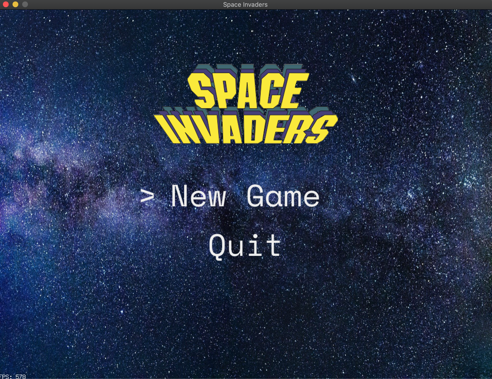
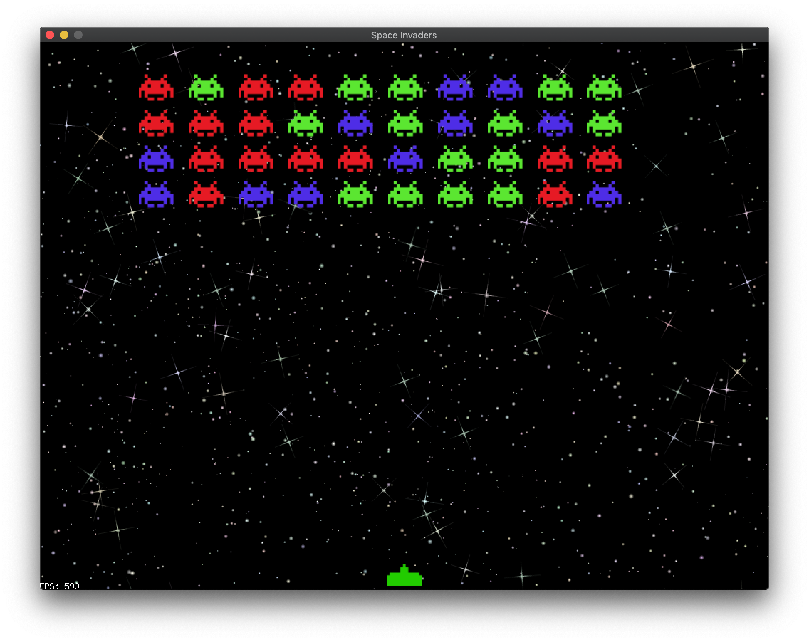

# Space Invaders

This is a Space Invaders clone written in Go, using the [Pixel](https://github.com/faiface/pixel) library.





## Running

```bash
make
```

## TO DO:

* ~~Make a menu to start the game~~
* ~~Scroll the background. That'd be cool~~
* Do something when the player kills all the invaders
* Blow up the ship when the invaders hit the bottom
* Add an explosion when an invader dies
* Add multiple levels where invaders get faster
* Add sound effects
* Maybe some music too...
* And animation...

## License

Copyright 2019 Adam Presley

Permission is hereby granted, free of charge, to any person obtaining a copy of this software and
associated documentation files (the "Software"), to deal in the Software without restriction,
including without limitation the rights to use, copy, modify, merge, publish, distribute,
sublicense, and/or sell copies of the Software, and to permit persons to whom the Software is
furnished to do so, subject to the following conditions:

The above copyright notice and this permission notice shall be included in all copies or
substantial portions of the Software.

THE SOFTWARE IS PROVIDED "AS IS", WITHOUT WARRANTY OF ANY KIND, EXPRESS OR IMPLIED, INCLUDING
BUT NOT LIMITED TO THE WARRANTIES OF MERCHANTABILITY, FITNESS FOR A PARTICULAR PURPOSE AND
NONINFRINGEMENT. IN NO EVENT SHALL THE AUTHORS OR COPYRIGHT HOLDERS BE LIABLE FOR ANY CLAIM,
DAMAGES OR OTHER LIABILITY, WHETHER IN AN ACTION OF CONTRACT, TORT OR OTHERWISE, ARISING FROM,
OUT OF OR IN CONNECTION WITH THE SOFTWARE OR THE USE OR OTHER DEALINGS IN THE SOFTWARE.